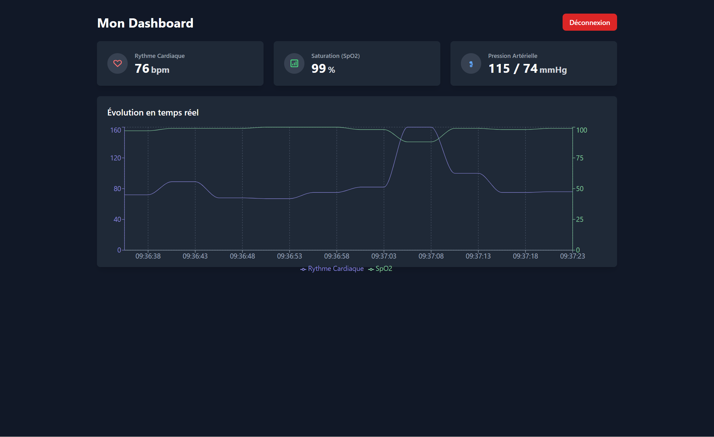

# 🏥 Health Monitoring Platform (IoMT) - PFE

Plateforme de télésurveillance médicale simulant des appareils connectés (wearables) pour le suivi en temps réel de la santé des patients avec alertes intelligentes et tableaux de bord multi-rôles. Ce projet a été développé dans le cadre d'un Projet de Fin d'Études (PFE).

[](Capture d'écran 2025-10-28 093732.png)
*Dashboard Patient affichant les données vitales en temps réel.*

[![Dashboard Alerte]Capture d'écran 2025-10-28 093732.png)](Capture d'écran 2025-10-28 093732.png)
*Notification d'alerte critique (Tachycardie) affichée sur le dashboard.*

## ✨ Fonctionnalités Principales

* **Simulation de Données Vitales :** Génération de données réalistes (rythme cardiaque, SpO2, pression artérielle) pour plusieurs patients.
* **Pipeline de Données Temps Réel :** Collecte, stockage (TimescaleDB) et diffusion (Redis Pub/Sub, WebSockets) des données en temps réel.
* **Authentification Sécurisée :** Système d'inscription et de connexion basé sur JWT avec gestion des rôles (Patient, Médecin, Admin - *partiellement implémenté*).
* **Détection d'Anomalies :**
    * Basée sur des règles cliniques (ex: bradycardie, hypoxie).
    * Basée sur l'apprentissage automatique (Isolation Forest).
* **Système d'Alertes Intelligent :** Génération d'alertes (stockées dans MongoDB) avec logique anti-spam, niveaux de sévérité, et notification temps réel au frontend.
* **Dashboard Patient Temps Réel :** Interface React (TypeScript, Tailwind CSS) affichant les données vitales en direct et les alertes via WebSockets.
* **Documentation API :** Interface Swagger UI interactive pour explorer et tester l'API backend.
* **Architecture Microservices :** Structure modulaire basée sur Docker Compose pour une meilleure scalabilité et maintenance.

[](URL_DE_VOTRE_CAPTURE_D_ECRAN_LOGS_SUR_GITHUB)
*Logs montrant la détection d'anomalie par Isolation Forest et le blocage par l'anti-spam.*

## 🏗️ Architecture Système

Le projet utilise une architecture microservices orchestrée par Docker Compose :

```mermaid
graph TD
    subgraph Frontend
        F[React App (Port 5173)]
    end

    subgraph Backend API
        GW[API Gateway (Node.js - Port 3000)]
    end

    subgraph Simulation
        SIM[Device Simulator (Node.js)]
    end
    
    subgraph Intelligence
        AE[Alert Engine (Node.js)]
        ML[ML Service (Python - Port 5000)]
    end

    subgraph Databases & Messaging
        TSDB[(TimescaleDB (Port 5432))]
        MDB[(MongoDB (Port 27017))]
        RDB[(Redis (Port 6379))]
    end

    F -- HTTP REST --> GW
    F -- WebSocket --> GW

    SIM -- HTTP POST /api/vitals --> GW

    GW -- SQL Insert --> TSDB
    GW -- Publishes 'vitals-channel' --> RDB

    RDB -- Subscribes 'vitals-channel' --> AE
    RDB -- Subscribes 'vitals-channel' --> GW
    RDB -- Subscribes 'alerts-channel' --> GW

    AE -- HTTP POST /predict --> ML
    AE -- Publishes 'alerts-channel' --> RDB
    AE -- Mongoose Write --> MDB[Alerts Collection]

    GW -- Mongoose Read/Write --> MDB[Users Collection]
    
    style F fill:#f9f,stroke:#333,stroke-width:2px
    style GW fill:#ccf,stroke:#333,stroke-width:2px
    style SIM fill:#cfc,stroke:#333,stroke-width:2px
    style AE fill:#fcf,stroke:#333,stroke-width:2px
    style ML fill:#fcf,stroke:#333,stroke-width:2px
    style TSDB fill:#ff9,stroke:#333,stroke-width:2px
    style MDB fill:#ff9,stroke:#333,stroke-width:2px
    style RDB fill:#ff9,stroke:#333,stroke-width:2px
