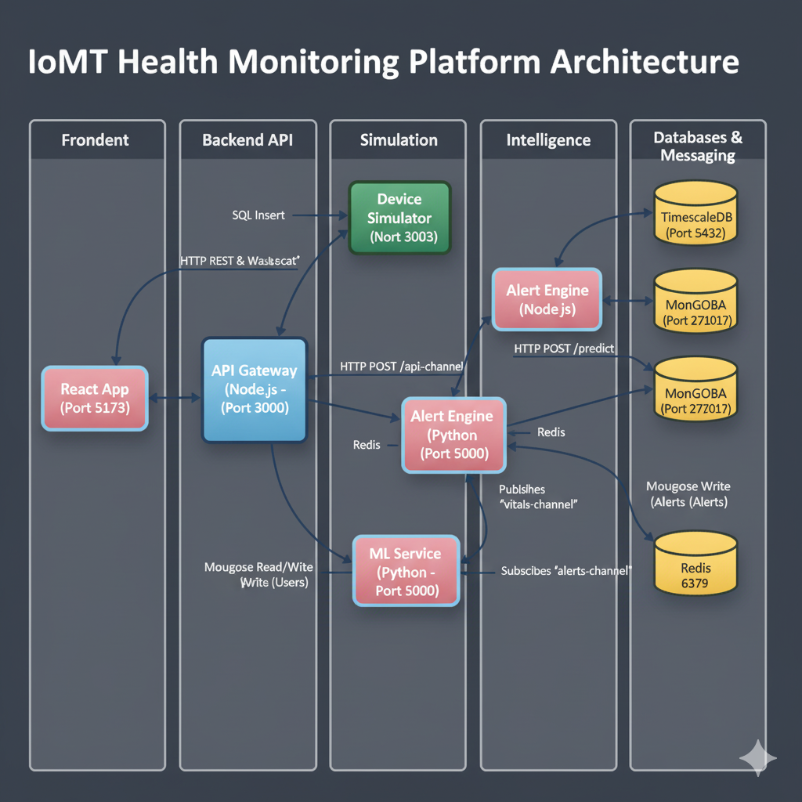

# 🏥 Health Monitoring Platform (IoMT) - PFE

Plateforme de télésurveillance médicale simulant des appareils connectés (wearables) pour le suivi en temps réel de la santé des patients avec alertes intelligentes et tableaux de bord multi-rôles. Ce projet a été développé dans le cadre d'un Projet de Fin d'Études (PFE).

*Dashboard Patient affichant les données vitales en temps réel.*

*Notification d'alerte critique (Tachycardie) affichée sur le dashboard.*

## ✨ Fonctionnalités Principales

* **Simulation de Données Vitales :** Génération de données réalistes (rythme cardiaque, SpO2, pression artérielle) pour plusieurs patients.
* **Pipeline de Données Temps Réel :** Collecte, stockage (TimescaleDB) et diffusion (Redis Pub/Sub, WebSockets) des données en temps réel.
* **Authentification Sécurisée :** Système d'inscription et de connexion basé sur JWT avec gestion des rôles (Patient, Médecin, Admin - *partiellement implémenté*).
* **Détection d'Anomalies :**
    * Basée sur des règles cliniques (ex: bradycardie, hypoxie).
    * Basée sur l'apprentissage automatique (Isolation Forest).
* **Système d'Alertes Intelligent :** Génération d'alertes (stockées dans MongoDB) avec logique anti-spam, niveaux de sévérité, et notification temps réel au frontend.
* **Dashboard Patient Temps Réel :** Interface React (TypeScript, Tailwind CSS) affichant les données vitales en direct et les alertes via WebSockets.
* **Documentation API :** Interface Swagger UI interactive pour explorer et tester l'API backend.
* **Architecture Microservices :** Structure modulaire basée sur Docker Compose pour une meilleure scalabilité et maintenance.

*Logs montrant la détection d'anomalie par Isolation Forest et le blocage par l'anti-spam.*

## 🏗️ Architecture Système

Le projet utilise une architecture microservices orchestrée par Docker Compose :

